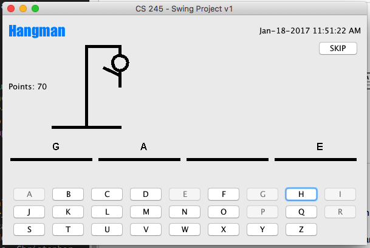

### Escuela Colombiana de Ingeniería
### Arquitecturas de Software - ARSW

## Laboratorio – Principio de Inversión de dependencias, Inversión de Control, Contenedores Livianos e Inyección de dependencias.
### Dependencias
* [ Taller – Principio de Inversión de dependencias, Contenedores Livianos e Inyección de dependencias.](https://github.com/ARSW-ECI-beta/DIP_DI-SPRING_JAVA-GRAMMAR_CHECKER)
### Descripción
Este laboratorio tiene como fin exponer un ejercicio
Para este ejercicio, va a hacer un proceso de _refactoring_ de una implementación del popular juego 'ahorcado'. El código está basado en el proyecto creado por Omar Rodriguez, Nahid Enayatzadeh, Marc Deaso, Christopher Santos, Jazmin Guerrero, y que está disponible en https://github.com/oarodrig/SwingHangman .

Se quiere tomar el código base 

* Desacoplar la lógica del juego de la representación del estado del mismo, pues en algunos países no se ve con buenos ojos la representación gráfica del ahorcado.

* Desacoplar la lógica del juego del idioma usado en el mismo. En este sentido, se debe tener en cuenta que el idioma considera: 
	* El juego de caracteres.
	* El conjunto de palabras.
	* Los textos usados en la interfaz de usuario.
### Parte I. 

	
En particular, este ejercicio requiere:

1. Aplicar el principio de Inversión de Dependencias en los elementos antes mencionados, agregando las interfaces y ajustando las dependencias que hagan falta.
2. Integrar en el proyecto el framework Spring, de manera que a través de este se pueda -en tiempo de ejecución- realizar la inyección de las dependencias que hagan falta.
3. Implementar el siguiente conjunto de 'beans' asociados al aspecto visual:

	* Representación estándar: el ahorcado convencional.
	* Representación amistosa: en lugar del ahorcado, se mostrará un signo de adiración sobre el personaje cada vez que se cometa un error:
	
		
4. Implementar el siguiente conjunto de 'beans' asociados al aspecto idiomático:

	* Elementos de interfaz en inglés: los usados actualmente.
	* Elementos de interfaz en francés: textos de la interfaz (botones, etiquetas, etc) en francés, juego de caracteres incluyendo: à, è, ì, ò, ù., un conjunto fijo de palabras en francés.
	* Elementos de interfaz para latinoamérica: textos de la interfaz (botones, etiquetas, etc) en español, juego de caracteres incluyendo la ñ. Para el caso del español, debe poder inyectar una de las siguientes fuentes de datos:
		1. Un conjunto estático de no más de 10 palabras.
		2. Un conjunto cargado a partir de una URL que apunte a un listado de palabras en texto plano (la cual también debe poderse inyectar), usando por ahora la siguiente: https://raw.githubusercontent.com/javierarce/palabras/master/listado-general.txt

